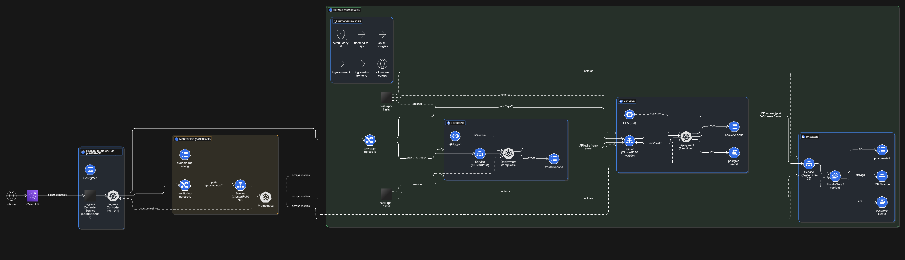

# ⚡ Kubernetes Task Manager

A full-stack task management application built to demonstrate core Kubernetes concepts including Deployments, Services, ConfigMaps, StatefulSets, Ingress, and monitoring. This project serves as a hands-on learning resource for understanding container orchestration with Kubernetes.

## 🎯 Learning Objectives

This project covers the following Kubernetes concepts:

- **Deployments** - Managing application lifecycle and rolling updates
- **Services** - Service discovery and load balancing
- **ConfigMaps** - Configuration management and application code injection
- **StatefulSets** - Managing stateful applications like databases
- **Persistent Volumes** - Data persistence for databases
- **Ingress** - External access and routing
- **Secrets** - Secure configuration management
- **Network Policies** - Micro-segmentation and security
- **Horizontal Pod Autoscaling** - Automatic scaling based on metrics
- **Resource Quotas & Limits** - Resource management and governance
- **Health Checks** - Liveness and readiness probes
- **Monitoring** - Prometheus integration

## 🏗️ Architecture



## 📦 Components

### Frontend
- **Technology**: HTML/CSS/JavaScript with nginx
- **Features**: Modern dark theme, responsive design, real-time updates
- **Deployment**: 2 replicas with health checks
- **Configuration**: Delivered via ConfigMaps

### Backend API
- **Technology**: Node.js with Express
- **Features**: RESTful API, PostgreSQL integration, health endpoints
- **Deployment**: 2 replicas with auto-scaling (HPA)
- **Configuration**: Environment variables from Secrets

### Database
- **Technology**: PostgreSQL 15
- **Deployment**: StatefulSet with persistent storage
- **Features**: Automatic initialization with sample data
- **Storage**: 1Gi persistent volume

### Monitoring
- **Technology**: Prometheus
- **Features**: Metrics collection, pod discovery
- **Access**: Available via Ingress at `/prometheus`

## 🚀 Quick Start

### Prerequisites

1. **Kubernetes Cluster** (one of the following):
   - Minikube (recommended for learning)
   - Kind (Kubernetes in Docker)
   - Docker Desktop with Kubernetes
   - Cloud provider (GKE, EKS, AKS)

2. **kubectl** configured to access your cluster

3. **NGINX Ingress Controller** (for external access):
   ```bash
   # For minikube
   minikube addons enable ingress
   
   # For other clusters
   kubectl apply -f https://raw.githubusercontent.com/kubernetes/ingress-nginx/main/deploy/static/provider/cloud/deploy.yaml
   ```

### Installation

1. **Clone the repository**:
   ```bash
   git clone <your-repo-url>
   cd kubernetes-task-manager
   ```

2. **Create the monitoring namespace**:
   ```bash
   kubectl apply -f monitoring-namespace.yaml
   ```

3. **Deploy secrets and configuration**:
   ```bash
   kubectl apply -f postgres-secret.yaml
   kubectl apply -f monitoring-auth-secret.yaml
   kubectl apply -f backend-configmap.yaml
   kubectl apply -f frontend-configmap.yaml
   kubectl apply -f postgres-init-configmap.yaml
   kubectl apply -f prometheus-config.yaml
   ```

4. **Deploy the database**:
   ```bash
   kubectl apply -f postgres-statefulset.yaml
   kubectl apply -f postgres-service.yaml
   ```

5. **Deploy the backend API**:
   ```bash
   kubectl apply -f backend-deployment.yaml
   kubectl apply -f backend-service.yaml
   ```

6. **Deploy the frontend**:
   ```bash
   kubectl apply -f frontend-deployment.yaml
   kubectl apply -f frontend-service.yaml
   ```

7. **Deploy monitoring**:
   ```bash
   kubectl apply -f prometheus-deployment.yaml
   kubectl apply -f prometheus-service.yaml
   ```

8. **Configure ingress and networking**:
   ```bash
   kubectl apply -f ingress.yaml
   kubectl apply -f network-policies.yaml
   ```

9. **Apply resource management**:
   ```bash
   kubectl apply -f resource-quota-range.yaml
   kubectl apply -f hpa.yaml
   ```

### Access the Application

1. **Get the Ingress IP**:
   ```bash
   kubectl get ingress
   ```

2. **Access the application**:
   - **Main App**: `http://<ingress-ip>/`
   - **Monitoring**: `http://<ingress-ip>/prometheus`

   For minikube:
   ```bash
   minikube ip
   # Use the returned IP address
   ```

## 📚 Learning Guide

### Phase 1: Core Concepts

Start by understanding these fundamental files:

1. **`postgres-statefulset.yaml`** - Learn about StatefulSets and persistent storage
2. **`backend-deployment.yaml`** - Understand Deployments and health checks
3. **`frontend-deployment.yaml`** - See how ConfigMaps inject application code
4. **`*-service.yaml`** - Learn about service discovery and load balancing

### Phase 2: Configuration Management

Study these configuration patterns:

1. **`postgres-secret.yaml`** - Secrets for sensitive data
2. **`backend-configmap.yaml`** - Application code in ConfigMaps
3. **`frontend-configmap.yaml`** - Static files and nginx configuration

### Phase 3: Advanced Features

Explore these advanced concepts:

1. **`ingress.yaml`** - External access and routing
2. **`network-policies.yaml`** - Network security and micro-segmentation
3. **`hpa.yaml`** - Horizontal Pod Autoscaling
4. **`resource-quota-range.yaml`** - Resource governance

### Phase 4: Monitoring

Learn about observability:

1. **`prometheus-deployment.yaml`** - Metrics collection setup
2. **`prometheus-config.yaml`** - Service discovery configuration

## 🔧 Useful Commands

### Debugging

```bash
# Check pod status
kubectl get pods -o wide

# View pod logs
kubectl logs -l app=task-api

# Describe a resource
kubectl describe deployment task-api

# Port forward for direct access
kubectl port-forward service/task-frontend-service 8080:80

# Execute commands in pods
kubectl exec -it <pod-name> -- /bin/sh
```

### Monitoring

```bash
# Check HPA status
kubectl get hpa

# View resource usage
kubectl top pods

# Check persistent volumes
kubectl get pv,pvc

# View network policies
kubectl get networkpolicies
```

### Scaling

```bash
# Manual scaling
kubectl scale deployment task-api --replicas=3

# Check autoscaling
kubectl describe hpa task-api-hpa

# View resource quotas
kubectl describe resourcequota task-app-quota
```

## 🛠️ Customization

### Modifying the Application

1. **Update frontend**: Edit `frontend-configmap.yaml` and redeploy
2. **Update backend**: Edit `backend-configmap.yaml` and redeploy
3. **Change database**: Modify `postgres-init-configmap.yaml`

### Configuration Changes

1. **Resource limits**: Edit `resource-quota-range.yaml`
2. **Scaling policies**: Modify `hpa.yaml`
3. **Network policies**: Update `network-policies.yaml`

## 📊 Metrics and Monitoring

The application includes Prometheus monitoring with:

- **Pod-level metrics**: CPU, memory, network
- **Application metrics**: Custom metrics from the API
- **Database metrics**: PostgreSQL connection statistics

Access Prometheus at `http://<ingress-ip>/prometheus` to explore metrics.

## 🔐 Security Features

This project implements several security best practices:

- **Network Policies**: Micro-segmentation between components
- **Secrets Management**: Sensitive data stored in Kubernetes Secrets
- **Resource Limits**: Prevents resource exhaustion
- **Health Checks**: Ensures only healthy pods receive traffic
- **RBAC**: Role-based access control (can be extended)

## 🚨 Troubleshooting

### Common Issues

1. **Pods not starting**:
   ```bash
   kubectl describe pod <pod-name>
   kubectl logs <pod-name>
   ```

2. **Service not accessible**:
   ```bash
   kubectl get svc
   kubectl get endpoints
   ```

3. **Database connection issues**:
   ```bash
   kubectl logs -l app=task-api
   kubectl exec -it <postgres-pod> -- psql -U postgres -d taskdb
   ```

4. **Ingress not working**:
   ```bash
   kubectl describe ingress
   kubectl get ingress
   ```

### Health Checks

The application includes comprehensive health checks:

- **Backend**: `/api/health` endpoint
- **Frontend**: nginx status page
- **Database**: `pg_isready` checks

## 🎓 Learning Resources

### Recommended Reading

1. [Kubernetes Documentation](https://kubernetes.io/docs/)
2. [Kubernetes Patterns](https://k8spatterns.io/)
3. [Best Practices Guide](https://kubernetes.io/docs/concepts/cluster-administration/manage-deployment/)

### Next Steps

After mastering this project, consider exploring:

1. **Helm Charts** - Package management for Kubernetes
2. **Operators** - Custom controllers for complex applications
3. **Service Mesh** - Istio or Linkerd for advanced networking
4. **GitOps** - ArgoCD or Flux for deployment automation
5. **Advanced Monitoring** - Grafana dashboards and alerting

## 🤝 Contributing

This project is designed for learning. Feel free to:

1. **Fork** the repository
2. **Experiment** with different configurations
3. **Add features** like Redis caching or message queues
4. **Improve documentation** with your learnings
5. **Share your experience** with the community

## 📜 License

This project is open source and available under the [MIT License](LICENSE).

## 💡 Tips for Success

1. **Start simple**: Deploy one component at a time
2. **Use kubectl describe**: When things don't work, describe the resources
3. **Check logs**: Application logs often reveal the root cause
4. **Understand networking**: Service discovery is key to multi-tier applications
5. **Practice scaling**: Try different scaling scenarios
6. **Explore monitoring**: Use Prometheus to understand your application's behavior

## 🏆 Achievements

By completing this project, you'll have hands-on experience with:

- ✅ Multi-tier application deployment
- ✅ Service mesh basics
- ✅ Database management in Kubernetes
- ✅ Auto-scaling configurations
- ✅ Security best practices
- ✅ Monitoring and observability
- ✅ Troubleshooting techniques

---

**Happy learning! 🚀**

*If you found this project helpful, please consider giving it a star ⭐ and sharing it with others who are learning Kubernetes!*